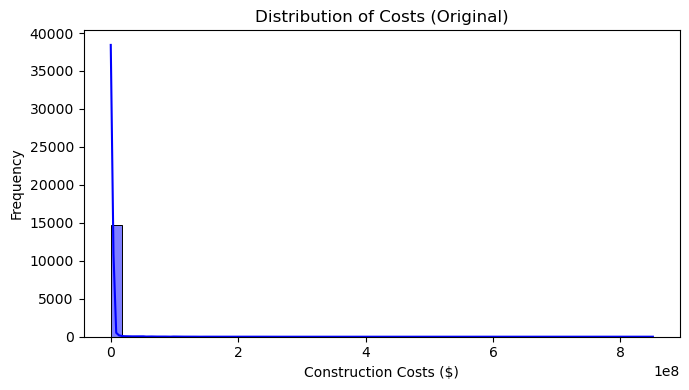
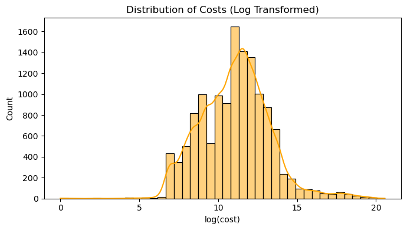
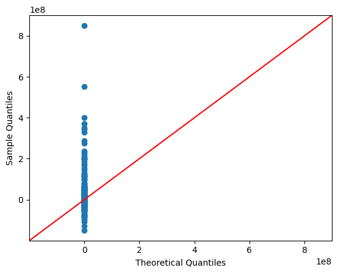
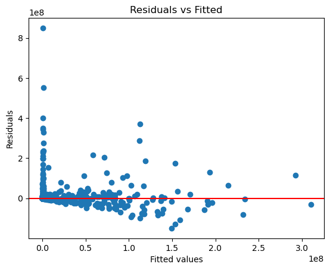
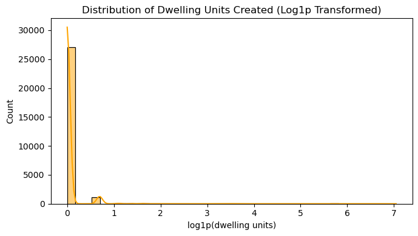

# toronto-building-permits-analysis

## Exploratory Analysis and Model Diagnostics

### Construction Cost Distribution — Original

The original construction cost distribution is highly right-skewed, with a small number of very large projects dominating the scale.

### Construction Cost Distribution — Log Transformed

A logarithmic transformation was applied to reduce skewness and improve the visibility of the overall distribution.

### Regression Q-Q Plot

The Q-Q plot was used to evaluate whether model residuals followed a normal distribution. The visible deviations indicate that the normality assumption was not fully satisfied.

### Residuals vs Fitted Values

The residual plot was used to assess variance consistency and model fit. The pattern and presence of extreme residuals suggest heteroscedasticity and influential observations.

### Dwelling Units Created — Log1p Transformed

The original dwelling-unit variable was strongly right-skewed. A `log1p` transformation was used because the variable includes zero values.

